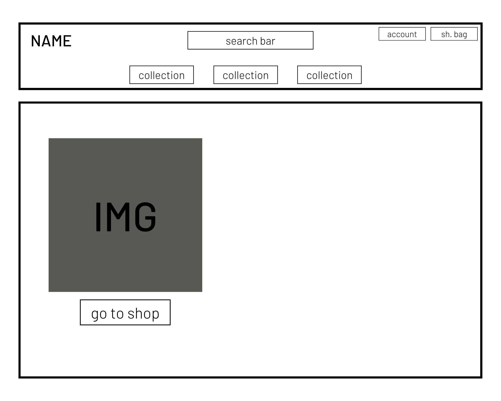
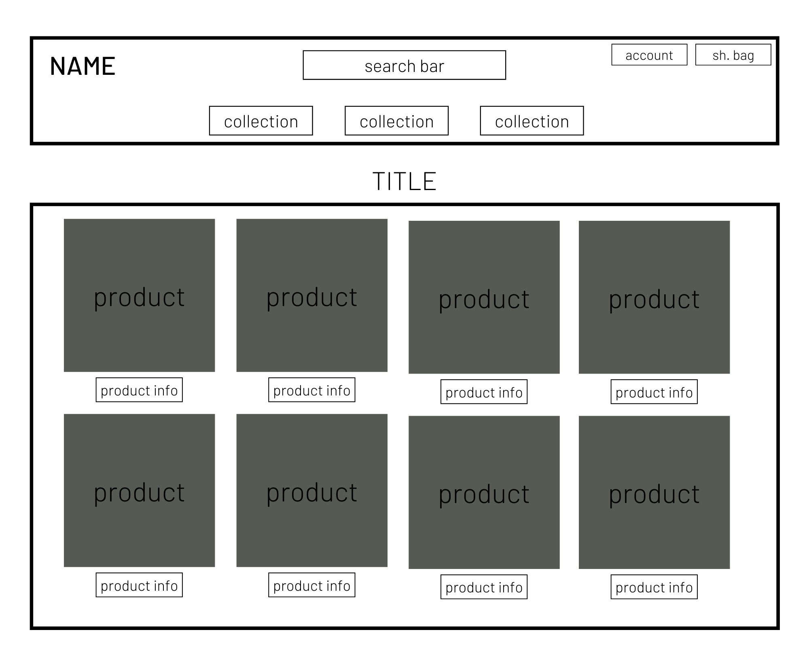
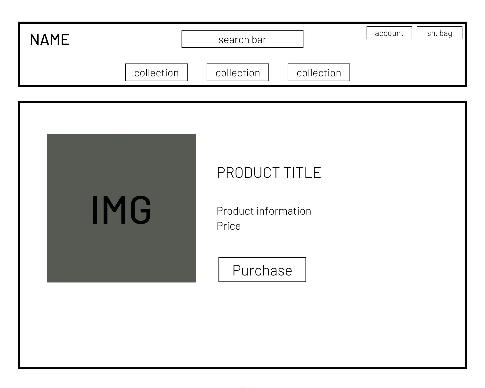
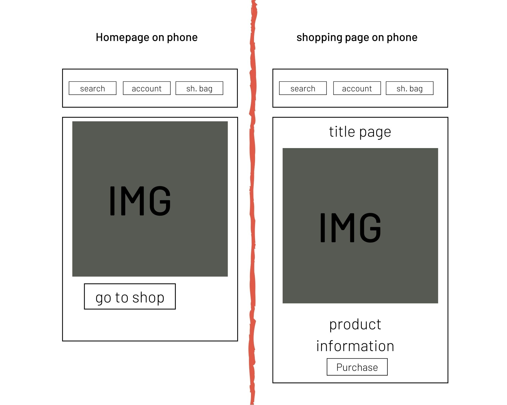
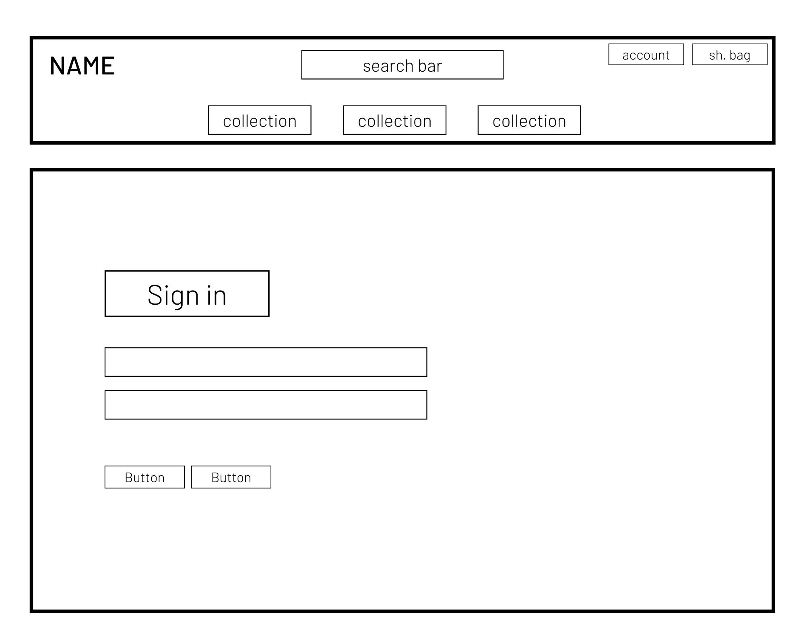
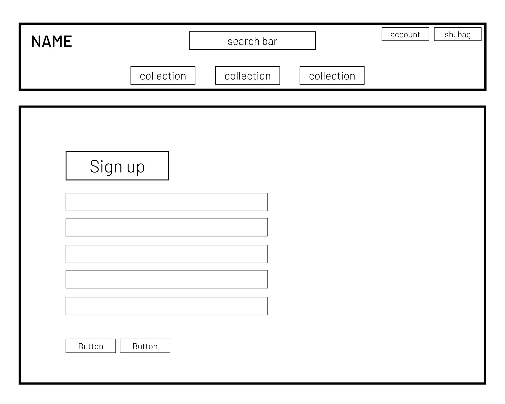
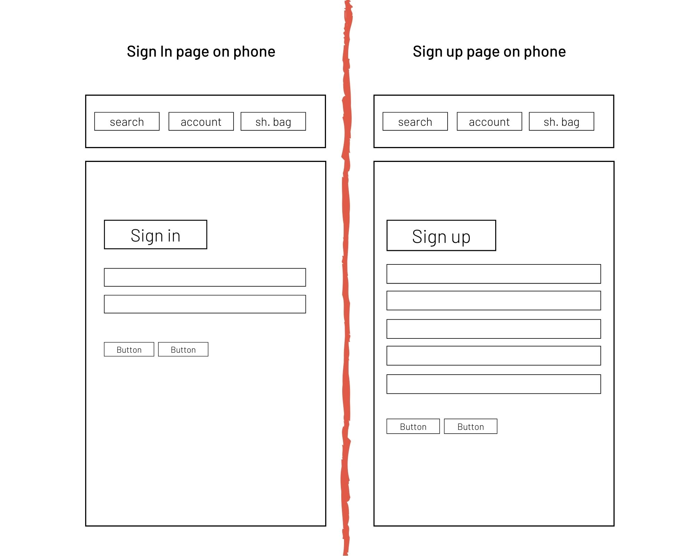
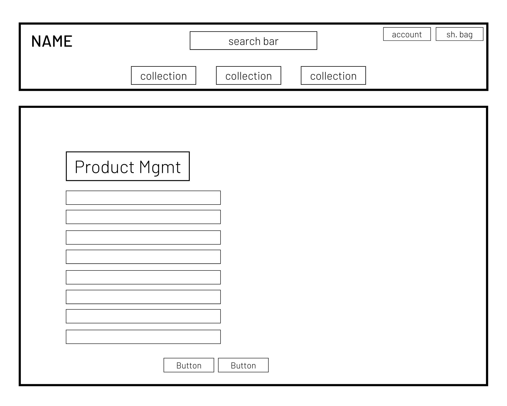
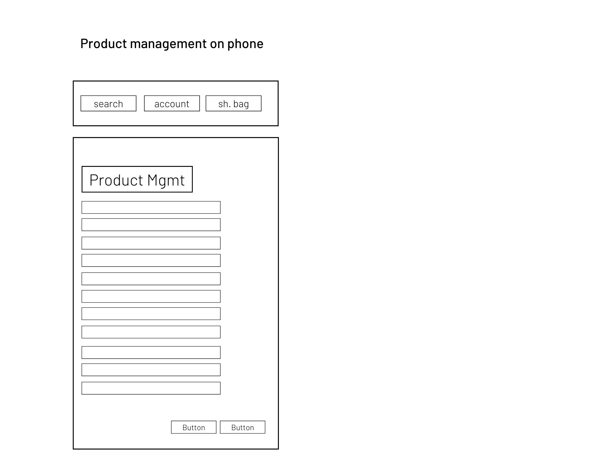

# Project name - L'auteliere

The project is E-commerce website for for fine art.
The owner is an instagrammer who is an amazing artist.

Due to popular demand for her art work, decided to open a online store.
She gets per month on the average 7 requests for purchases.
Her instagram page is growing with 20 people per week, she now has over 1020 art fans 
and it continues to grow each day.

 
## UX - Who is the website for?
https://lautelier.herokuapp.com/
 
The website is for anyone who loves modern art and the style of art of L'autelier. 
The website is also for all her fans on instagram who love and edmire her art work.
She has being receiving orders outside instagram as well and now more clients can reach her from website.

With this website a user can buy art work, search for specific art peace and can adjust their buying patterns 
incase they changed their mind on what product to buy.

# wireframes!
### The wireframes show how the website will look on two different devices.
### The design is based on a simple and clean finishes on your mobile sense most customers are using phones to connect with the artist on instagram.

# wireframes!

## Features
The project has many different apps and functionalities all based on PROJECT REQUIREMENTS. 
The application is a E-commerce based and logic
The application has Authentication and Security for customer purchases and sign up to track down their past transations.

### Existing Features
- Feature 1 - users to sign up and register to track their payments. For admin it allows L'autelier to collect emails and track purchases.
- Feature 2 - users can pick a product, add the product to checkout bag.
- Feature 3 - user would have to register to persist their shopping cart between sessions
- Feature 4 - users can fill a form to checkout product providing payment card information and email, home address and country etc.
- Feature 5 - users can purchase any art work and their information and purchase data will be saved and stored.
- Feature 6 - users can click on images and add them to cart basket and continue to shop.
- Feature 7 - users can easily enjoy responsive design, image presentation.
- Feature 8 - users can navigate effertless if their using ipad laptop or most importantly mobile phone.
- Feature 9 - users can enjoy the consistancy of modern high quality art.

### additional features to be implemented in the future:
- Form That allows customers to upload a photo they would like lining portrait of.
- More art work.
- Subscription based stripe system, allows customers to receive new prints of art every 3 months.

### Features Left to Implement
- Connect instagram to the website so customers can see previous posts on instagram on the website.

## Technologies Used
- HTML, CSS, JavaScript, Python+Django, Jinja+Django, Jquery,
- Bootstrap, 
- Fontawesome,
- Postgres,
- Stripe payments system,
- Git & GitHub for version control,
- hosting platform such as Heroku,
- AWS bucket for storage or images and etc. https://aws.amazon.com/
- Gmail for email confirmation
- https://jsonformatter.org/
- The artist instagram page for design inspiration. https://www.instagram.com/lautelier/
- https://django-allauth.readthedocs.io/en/latest/installation.html
- Google fonts. https://fonts.google.com/?category=Sans+Serif&preview.size=19&sidebar.open=true&selection.family=Montserrat:wght@300

### links used on project from : google fonts/ fontawesome/ jquey/ bootstrap/ cdn js. 
- https://stackpath.bootstrapcdn.com/bootstrap/4.4.1/css/bootstrap.min.css
- https://fonts.googleapis.com/css2?family=Montserrat:wght@300&display=swap
- https://kit.fontawesome.com/bdd1e310d0.js
- https://code.jquery.com/jquery-3.4.1.min.js
- https://cdn.jsdelivr.net/npm/popper.js@1.16.0/dist/umd/popper.min.js 
- https://stackpath.bootstrapcdn.com/bootstrap/4.4.1/js/bootstrap.min.js
        

## Testing

I tested the the project on different browsers chrome, safari and firefox, and the website works well including on mobile.

1. Contact form:
    1. Go to the "Contact Us" page
    2. Try to submit the empty form and verify that an error message about the required fields appears
    3. Try to submit the form with an invalid email address and verify that a relevant error message appears
    4. Try to submit the form with all inputs valid and verify that a success message appears.
    5. Try using wrong email address without @ and it will throw an error
    6. Unless you are an administrator on the website you can not delete images or add them or edit them.
    7. If your payment information is not input the right way as is asked on the site it will throw and error and tell you how to input information correctly.

The main issues I had that made me create the same website twice was Deployment! I made me waist 2 weeks and I was only successful on the third week!
With a lot of sleepless nights and assisitance from tutors I managed to to so. My main issue was my terminal was not working well. I had to deploy on the
Heroku site and make all changes and adjustments from there.

## Deployment

- There is separate git branch called newBrach which i merged with the main branch called master. The master branch is where Procfile is pushed in.

### running code locally.
 - to run the code locally after installing all file needed which you can find in REQUIREMENTS.TXT files, you must run the code.
 To run the code, go to your terminal and type (python3 manage.py runserver) --> once your port 8000 is open click on open Browser.

### django-heroku
Configuration to host a Django project at Heroku

- Create the project directory
* mkdir directory_name
* cd directory_name

- Create and activate your virtuanenv

- Installing django
* pip install django

- Create the django project
* django-admin startproject (myproject)

- Creating the Git repository
* git init 
* Create a file called ( .gitignore ) with the following content:
* git add .
* git commit -m 'First commit'
* git push

- Settings.py
* from pathlib import Path / import os /import dj_database_url
* SECRET_KEY = config('SECRET_KEY')
* DEBUG = config('DEBUG', default=False, cast=bool) (but made sure noone can see my setting information to keep it from being missused by someone else)

- Settings.py - start 
* from dj_database_url import parse as dburl

default_dburl = 'sqlite:///' + os.path.join(BASE_DIR, 'db.sqlite3')

DATABASES = {
    'default': config('DATABASE_URL', default=default_dburl, cast=dburl),
}
 - end

- files required to be installed so app could work perfectly.
* asgiref==3.3.1
* boto3==1.16.35
* botocore==1.19.35
* dj-database-url==0.5.0
* Django==3.1.4
* django-allauth==0.44.0
* django-countries==7.0
* django-crispy-forms==1.10.0
* django-storages==1.10.1
* gunicorn==20.0.4
* jmespath==0.10.0
* oauthlib==3.1.0
* Pillow==8.0.1
* psycopg2-binary==2.8.6
* PyJWT==1.7.1
* python3-openid==3.2.0
* pytz==2020.4
* requests-oauthlib==1.3.0
* s3transfer==0.3.3
* sqlparse==0.4.1
* stripe==2.55.1

- Creating the app at Heroku
You can follow these steps on the link : https://devcenter.heroku.com/articles/heroku-cli

- Heroku install config plugin
* heroku plugins:install heroku-config

- Sending configs from .env to Heroku ( You have to be inside tha folther where .env files is)
* heroku plugins:install heroku-config
* heroku config:push -a

- To show heroku configs do
* heroku config 
(if you fail changing by code, try changing by heroku dashboard, which is what happen to my project. I had to do 70% of configuration from the dashboard! ) 

- Publishing the app
* git add .
* git commit -m 'Configuring the app'
* git push heroku master 

- Creating the data base 
* heroku run python3 manage.py migrate

- Creating the Django admin user
* heroku run python3 manage.py createsuperuser (the same as above)

## Credits

### Content
- All the navigation and page layout have come from Bootstrap and Django templates.
- I used https://stackoverflow.com/ to try to solve some issues I had.
- Also got helped from code institute tutors, to give me instructions on how to fix my Deployment issues I had.
- Also used inspiration from examples from the code institute lessons and I also found the the lesson files useful to compare my code and DEBUG as well.

### Media
- The photos used in this site were obtained from lautelier page on instagram, given to me by the owner of the actual instagram page.

### Acknowledgements

- I received inspiration for this project from code institute Mentor and my wife whom Helped me pay for the course.
- I also lke to thank all the tutors whom put up with all the issues I had on this project. I never really used tutors for the course, until I got to this project.
- The tutors were truly helpful and I hope one day I could also DEBUG them. I truly felt inspired by how much they know that I wish to do the same one day,
help other students or employees with their coding problems. 

